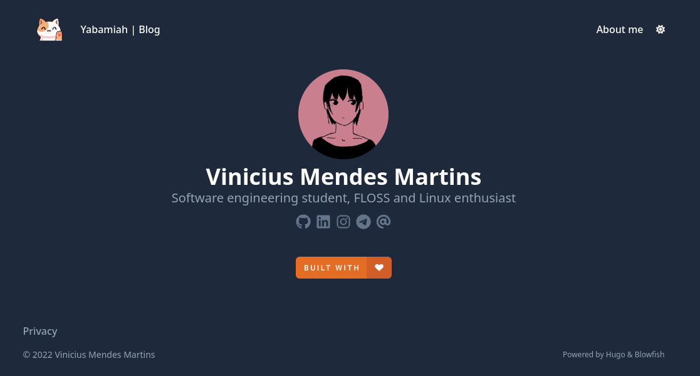

# My personal website 


<p>I build my website using the Hugo framework, the Blowfish theme and hosted it on Netlify.</p>
<p align="center"></p>

### To do
- [x] About me
- [ ] Projects
- [ ] Blog 

### To run locally
1. Install Go and Hugo
2. Clone this repository
3. Run ```cd site``` and ```hugo serve``` in your terminal
